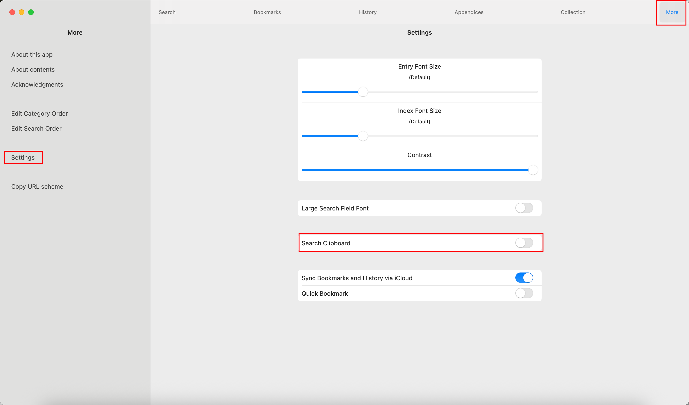

# Frequently Asked Questions

Q: I see the message “物書堂で引きました”, but nothing happens on the Monokakido side. However, the word history is recorded in Copilot History. Could this be a settings issue? (I'm using a Mac.)

A: On Mac, please make sure that “Clipboard Search” is **enabled** in the Monokakido settings.

